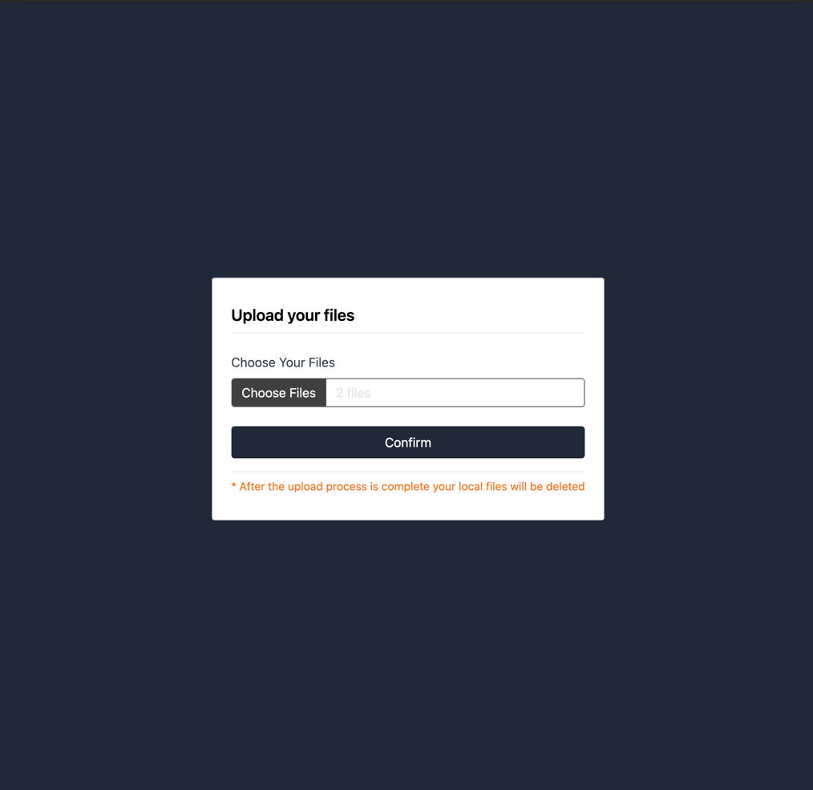
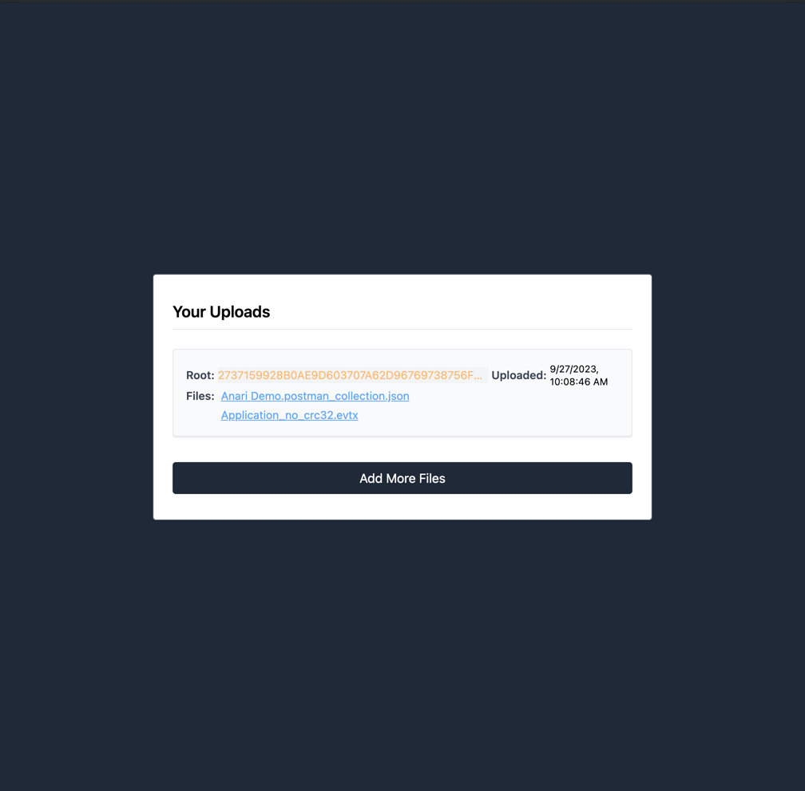

## Project Structure

- **`docker-compose.yml`**: Defines how to set up and run our application containers.

- **`fclient`**: This directory contains the client-side application.
    - **Exposed on**: `localhost:3001`
    - **Functionality**: Provides a web-based user interface for interacting with the system. Allows users to upload
      files and later download them, ensuring their integrity using the Merkle tree proofs.

- **`fserver`**: This directory encompasses the server-side application.
    - **File Storage**: Stores files locally in a directory named `files`.
    - **Naming Convention**: Uses file hash for naming, which not only guarantees the uniqueness of each file but also
      prevents any potential file duplication.
    - **Networking & Communication**: Communicates with the client application and facilitates file upload and
      retrieval.

- **`shared`**: This is a utilities directory common to both the client and server.
    - **Hashing Utility**: Provides an interface for generating secure file hashes.
    - **Merkle Tree Implementation**: Houses the self-implemented Merkle tree logic that's crucial to the
      integrity-checking process of files.
    - **Tracing**: Helps in debugging and logging the flow of the application.
    - **Persistence Layer**: Implements persistence using LEVEL DB, ensuring data durability and fast retrieval.

Both the server (`fserver`) and client (`fclient`) applications have been implemented using the Axum framework. Axum is
a modular web framework, which provides a concise way of building highly concurrent web applications and microservices.
___

## Addressing Task Requirements

1. **File Upload on Client**:
   The client application, running on `localhost:3001`, allows users to upload multiple files to the server.

2. **Merkle Tree Implementation**:
   Instead of leveraging a library, we implemented our own Merkle tree housed within the `shared` utilities directory.
   This ensures that files, when fetched back from the server, can be validated for their integrity using the Merkle
   proof against the root hash that the client retained.

3. **File Retrieval & Integrity Check**:
   Users can request to download any file they previously uploaded. Along with the file, the server provides a Merkle
   proof. The client application then uses this proof, combined with its retained root hash, to verify the integrity of
   the downloaded file.

4. **Networking for Deployment across Machines**:
   Leveraging the Docker Compose tool, our solution is designed to be deployable across multiple machines. The
   encapsulation provided by Docker ensures a consistent environment across different deployments.

___

## App interface

### Home Page -- No Uploads

### Upload Page -- Select Files

### Home Page -- With Uploads

---
## Closing Thoughts

Our solution provides a user-friendly interface to interact with the system while ensuring data integrity at its core
using the Merkle tree structure. Utilizing the Axum framework has enabled us to build a responsive, concurrent system
capable of handling multiple user requests seamlessly.

While our current implementation is robust, potential enhancements for the future could include introducing encryption
for files, further optimizing the Merkle tree generation process, and expanding on the persistence layer to support
distributed databases for even greater scalability.

